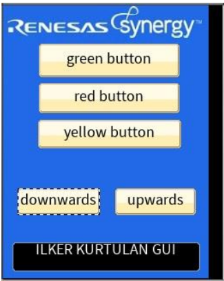
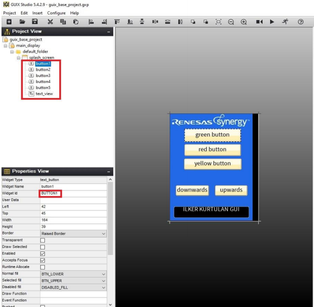
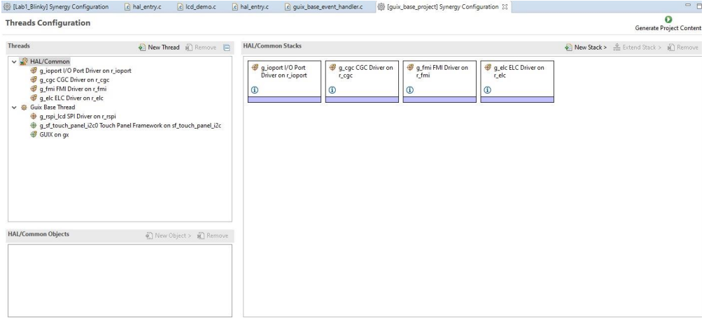
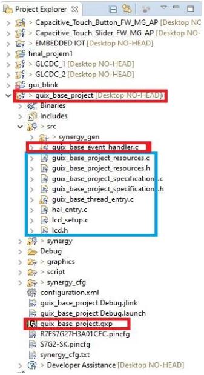

# Renesas-S7G2-GUI-Led-control

The detailed explanation of the project is inside the repository.

GUI project for led sequences.

As it seen on the figure 1 , the simple design is built using GUIX
Studio’s properties. After right clicking the “splash screen” it can be
seen that , it offers us different options like including text , buttons ,
sliders etc. On my design I used text button property and combined
these buttons with the “ event_base_handler.c ” to give each button a
functionality.

The inserted buttons have to be edited. On the
red indicator we can change it’s API name in
order to use it on “ event_base_handler.c ”. If
we continue sliding down , we can see the
name changing property for our button.

In order to give functionality to buttons , editing has to be done on “
event_base_handler.c ” file indicated with red square. The blue square c /
header files are coming from the configuration threads segment. When we
include lcd and gui threads , it automatically includes these c / header files
in our “ src “ folder. We can also see our gui design as
“guix_base_project.gxp “ file down below highlighted with red.
Inside the “ event_base_handler.c ” , for each gui property that user add,
renesas bsp creates different cases for each property added. On the first three
cases I programmed the led to toggle according to user’s press on the lcd
screen. In these cases I used bsp_leds api in order to reach every led state
individually.
For button 4 & 5, I defined local variables like ; leds , pin_state , freq_in_hz
, bsp_delay_units and delay. I wrote simple sequence that follows the led
patterns upwards and downwards by opening and closing the leds with small
delay.

